# Вредные привычки

**Раздел:** 3.1. Здоровый образ жизни → Вредные привычки  
**Дата создания:** 2026-03-19

---

## 📖 Описание направления

Раздел детской энциклопедии, посвящённый вредным привычкам. Основная идея — объяснить ребёнку 10 лет, что такое вредные привычки, как они формируются, почему они опасны и как от них защититься. Тексты написаны простым и доступным языком с использованием примеров из жизни.

## 🧠 Онтология предметной области

### Визуализация (Mermaid)

```mermaid
graph TD
    VP["🚫 Вредные привычки"]

    VP --> SUBSTANCE["🧪 Употребление веществ"]
    VP --> BEHAVIOR["📱 Поведенческие зависимости"]
    VP --> LIFESTYLE["🛋️ Образ жизни"]
    VP --> SOCIAL["👥 Социальные факторы"]

    %% Употребление веществ
    SUBSTANCE --> SMOKING["Табакокурение"]
    SUBSTANCE --> VAPING["Вейпинг"]
    SUBSTANCE --> ALCOHOL["Алкоголь"]
    SUBSTANCE --> DRUGS["Наркотики"]
    SUBSTANCE --> ENERGY["Энергетики"]

    %% Поведенческие зависимости
    BEHAVIOR --> ADDICTION["Зависимость"]
    BEHAVIOR --> GAMING["Игровая зависимость"]
    BEHAVIOR --> INTERNET["Интернет-зависимость"]
    BEHAVIOR --> PROCRASTINATION["Прокрастинация"]

    %% Образ жизни
    LIFESTYLE --> JUNKFOOD["Неправильное питание"]
    LIFESTYLE --> SEDENTARY["Малоподвижность"]
    LIFESTYLE --> SLEEPLACK["Недосыпание"]

    %% Социальные факторы
    SOCIAL --> PEERPRESSURE["Давление сверстников"]
    SOCIAL --> BULLYING["Буллинг"]
    SOCIAL --> PREVENTION["Профилактика"]

    %% Горизонтальные связи
    ADDICTION -.- SMOKING
    ADDICTION -.- ALCOHOL
    ADDICTION -.- GAMING
    ADDICTION -.- INTERNET
    PEERPRESSURE -.->|провоцирует| SMOKING
    PEERPRESSURE -.->|провоцирует| ALCOHOL
    ENERGY -.->|связан с| SLEEPLACK
    JUNKFOOD -.->|связан с| SEDENTARY
    PREVENTION -.->|противодействует| VP

    %% Стили
    classDef substance fill:#ffcdd2,stroke:#c62828
    classDef behavior fill:#e1bee7,stroke:#6a1b9a
    classDef lifestyle fill:#fff9c4,stroke:#f9a825
    classDef social fill:#c8e6c9,stroke:#2e7d32
    classDef root fill:#bbdefb,stroke:#1565c0

    class SUBSTANCE,SMOKING,VAPING,ALCOHOL,DRUGS,ENERGY substance
    class BEHAVIOR,ADDICTION,GAMING,INTERNET,PROCRASTINATION behavior
    class LIFESTYLE,JUNKFOOD,SEDENTARY,SLEEPLACK lifestyle
    class SOCIAL,PEERPRESSURE,BULLYING,PREVENTION social
    class VP root
```

### Описание связей

| Тип связи | Обозначение | Примеры |
|-----------|-------------|---------|
| **Иерархическая** (подвид / включает) | Сплошная линия → | Вредные привычки → Табакокурение |
| **Горизонтальная** (влияет / связан) | Пунктирная линия -.- | Зависимость ↔ Курение; Давление сверстников → Алкоголь |
| **Функциональная** (противодействует) | Пунктирная линия -.-> | Профилактика → Вредные привычки |

### Предварительный список понятий

| # | Понятие | Категория |
|---|---------|-----------|
| 1 | Табакокурение | Вещества |
| 2 | Вейпинг | Вещества |
| 3 | Алкоголь и подростки | Вещества |
| 4 | Наркотики | Вещества |
| 5 | Энергетические напитки | Вещества |
| 6 | Зависимость (аддикция) | Поведение |
| 7 | Игровая зависимость | Поведение |
| 8 | Интернет-зависимость | Поведение |
| 9 | Прокрастинация | Поведение |
| 10 | Неправильное питание | Образ жизни |
| 11 | Малоподвижный образ жизни | Образ жизни |
| 12 | Недосыпание | Образ жизни |
| 13 | Давление сверстников | Социальное |
| 14 | Буллинг | Социальное |
| 15 | Профилактика вредных привычек | Социальное |

> Список предварительный — будет уточнён после написания статей.

## Участники группы

| # | ФИО | Понятия |
|---|-----|---------|
| 1 | | |
| 2 | | |
| 3 | | |
| 4 | | |
| 5 | | |
